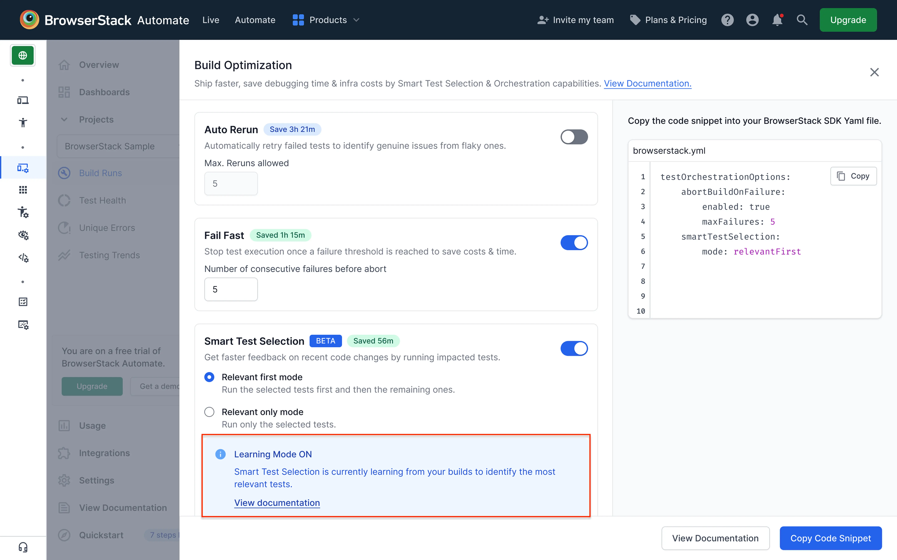
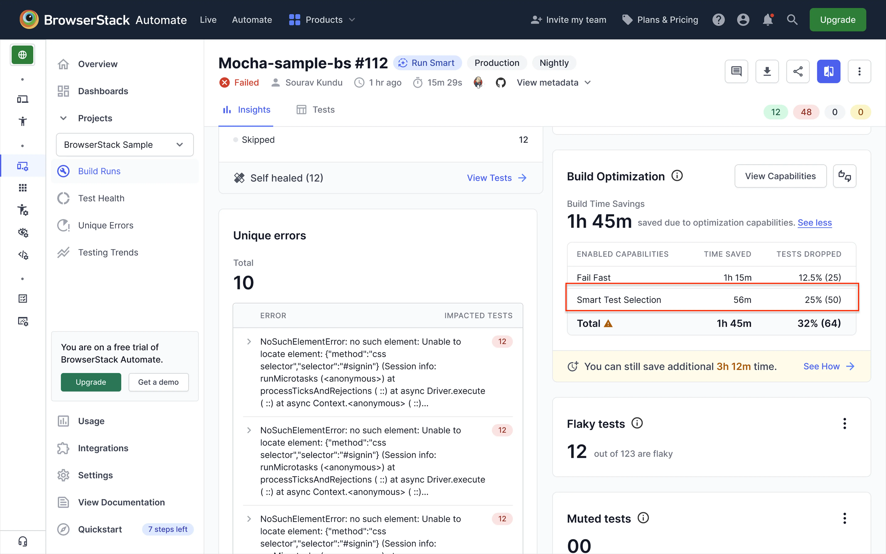

# Smart Test Selection & Orchestration AI Agent Demo for BrowserStack Automate

## Table of Contents
- [What is Smart Test Selection?](#-what-is-smart-test-selection)

- [Introduction](#-introduction)

- [Setup Instructions](#-setup-instructions)
  - [Prerequisites](#-prerequisites)
  - [Step 1: Clone and Run Demo Application](#-step-1-clone-and-run-demo-application)
  - [Step 2: Clone and Build Test Repository](#-step-2-clone-and-build-test-repository)
  - [Step 3: Run Your First Tests](#-step-3-run-tests)

- [Smart Test Selection Configuration](#-smart-test-selection-configuration)
    
- [Running the Demo](#-running-the-demo)
  - [Learning Mode](#-learning-mode)
  - [Prediction Mode](#-prediction-mode)
  
- [Additional Resources](#-additional-resources)

---

## What is Smart Test Selection?

**BrowserStack’s Smart Test Selection** is an AI-powered agent that determines the impact of code changes on your test suite and intelligently selects the relevant tests to run — helping you ship faster with fewer builds, reduced infrastructure costs, and quicker feedback loops.

## Introduction

This repository demonstrates Smart Test Selection in action using the TestNG-based Java framework. It integrates with the BrowserStack Java SDK and demonstrates how AI-powered test selection can optimize your test execution by running only relevant tests based on code changes.

**The demo setup uses two repositories:**
- Application Code Repo – [test-selection-demo-app-browserstack](https://github.com/browserstack/test-selection-demo-app-browserstack)
- Test Code Repo – [test-selection-demo-test-browserstack](https://github.com/browserstack/test-selection-demo-test-browserstack)

You will run builds to observe:  
- **Learning Mode** – when the agent learns from the code diff metadata and test execution data  
- **Prediction Mode** – when the agent starts predicting and running only relevant tests

**Test Execution Modes**:
- `relevantFirst`: Runs relevant tests first, then remaining tests
- `relevantOnly`: Runs only relevant tests

---

## Setup Instructions

### Prerequisites

-  **Java 11 or higher**: [Download Java](https://www.oracle.com/java/technologies/downloads/)  
   After installation, set your `JAVA_HOME` environment variable:  
    - **Mac / Linux**
        ```bash
        export JAVA_HOME=$(/usr/libexec/java_home)
        ```
    - **Windows (PowerShell)**
        ```powershell
        setx JAVA_HOME "C:\Program Files\Java\jdk-11"
        ```

-  **Maven 3.6 or higher**: [Download Maven](https://maven.apache.org/download.cgi)  
     After installation, add Maven to your system `PATH`:
     - **Mac / Linux**
        ```bash
        export PATH=$PATH:/opt/apache-maven-3.6.3/bin
        ```
    - **Windows (PowerShell)**
        ```powershell
        setx PATH "%PATH%;C:\apache-maven-3.6.3\bin"
        ```

- **Node.js 16 or higher**: [Download Node.js](https://nodejs.org/en/download)  

-  **Git**: [Download Git](https://git-scm.com/downloads)

- **BrowserStack Account**:  
    - Sign up at [BrowserStack](https://www.browserstack.com/) for cloud testing
    - Ensure AI is enabled in your BrowserStack Account. For more details, see [activate BrowserStack AI preferences](https://www.browserstack.com/docs/iaam/settings-and-permissions/activate-browserstack-ai)

---

### Step 1: Clone and Run Demo Application
```
# Clone the demo application repository
git clone https://github.com/browserstack/test-selection-demo-app-browserstack.git
cd test-selection-demo-app-browserstack

# Install all dependencies (root, client, and server)
npm run install:all

# Start the application (runs on port 3000)
npm start
```

The application will start:
-  **Frontend**: http://localhost:3000
-  **Backend API**: http://localhost:5001

Keep this running in a separate terminal.

### Step 2: Clone and Build Test Repository

```
# Clone this test repository
git clone https://github.com/browserstack/test-selection-demo-test-browserstack.git
cd test-selection-demo-test-browserstack

# Checkout the TestNG demo branch
git checkout testng-automate

# Build the project (downloads dependencies)
mvn clean install
```  
Update `username` and `accesskey` in the browserstack.yml file with your BrowserStack access credentials retrieved from [here](https://www.browserstack.com/accounts/profile/details)

### Step 3: Run Your First Tests

```
# Run all tests locally (to verify setup)
mvn test
```
---

## Smart Test Selection Configuration

BrowserStack offers **two methods** to enable Smart Test Selection in your test automation workflows:

1. **Repository Cloning:** (used in this demo)  
   BrowserStack clones your application source code locally (from a git repo or local path) to analyze code changes and select relevant tests.  
   [Learn more](https://www.browserstack.com/docs/automate/selenium/smart-test-selection?fw-lang=java#Repo_cloning)

2. **GitHub App Integration:**  
   BrowserStack's GitHub App connects directly to your GitHub repository for seamless code analysis and test selection—no manual cloning required.  
   [Learn more](https://www.browserstack.com/docs/automate/selenium/smart-test-selection?fw-lang=java#GitHub_app)


> **Note:**  
> For this demo, since **repository cloning** is used, the demo application code must be cloned locally for test execution

### browserstack.yml Configuration: 

Update your `browserstack.yml` as given below to enable Smart Test Selection using repo cloning:

```yaml
browserstackLocal: true # for local testing
testOrchestrationOptions:
  runSmartSelection:
    enabled: true
    source:
      - '<path_to_demo_code_locally_cloned>'
    mode: 'relevantOnly'
```

- Replace `<path_to_demo_code_locally_cloned>` with the actual local path of the cloned demo application repository.

---

## Running the demo  

**Use the Demo Application to Simulate Application Code Changes:**  
To simulate code changes, you can use any existing pull request (PR) or create a new PR in [test-selection-demo-app-browserstack](https://github.com/browserstack/test-selection-demo-app-browserstack) with updates or small bugs  
In the demo app repository, check out a feature branch with known changes (for example: [search_section_bug](https://github.com/browserstack/test-selection-demo-app-browserstack/tree/search_section_bug), [add_product_error_msg](https://github.com/browserstack/test-selection-demo-app-browserstack/tree/add_product_error_msg), or [new_product_bug](https://github.com/browserstack/test-selection-demo-app-browserstack/tree/new_product_bug))  

### Learning Mode  
In this mode, the agent learns relationships between code changes and tests.
1. In the test repo, update your `browserstack.yml` with build details:
    ```yaml
    projectName: Sample Smart Test Selection Project
    buildName: Sample Smart Test Selection Learning Build
    ```

    > **Note:**  
    > You can also use any other `buildName` that contains only alphabets and underscores. Avoid dynamic names with numbers, dates, or timestamps.  
    > Ensure that both projectName and buildName remain static and consistent across builds (to ensure that all executions of the same build are grouped together for learning and
    > prediction)

2. Run the test suite:
   ```
   mvn test
   ```
   When you execute tests, Smart Test Selection compares your checked-out branch with the base branch (main), analyzes code diffs, and learns which tests are impacted

3. Check results on your [BrowserStack Automate Dashboard](https://automate.browserstack.com/overview?tab=all)  
   Go to your Build View → Insights tab → Build Optimization widget → View capabilities
   You should see the Learning Mode indicator enabled for this build  

     

### Prediction Mode
Once training is complete, the agent begins predicting which tests to run for each change
1. In the test repo, update your `browserstack.yml` with build details:
    ```yaml
    projectName: Sample Smart Test Selection Project
    buildName: Sample Smart Test Selection Prediction Build
    ```

    > **Note:**  
    > Use the provided `buildName` to access a build where agent is already in prediction mode (saves the initial learning time)  
    > If you use a new buildName, the agent will start in learning Mode and typically needs 12–20 builds to learn before predicting  
    > Ensure that both projectName and buildName remain static and consistent across builds (to ensure that all executions of the same build are grouped together for learning and                prediction)

2. Run the test suite:
   ```
   mvn test
   ```

3. Check results on your [BrowserStack Automate Dashboard](https://automate.browserstack.com/overview?tab=all)  
   Go to your Build View → Insights tab → Build Optimization widget.
   The Build Optimisation Widget shows the percentage of tests skipped and the total time saved for the build  

     

---

## Additional Resources

- [BrowserStack Automate Dashboard](https://automate.browserstack.com/overview?tab=all) - View test execution results
- [Smart Test Selection Documentation (Java)](https://www.browserstack.com/docs/automate/selenium/smart-test-selection?fw-lang=java) - Learn more about how Smart Test Selection works
- [BrowserStack Java SDK Docs](https://www.browserstack.com/docs/automate/selenium/sdk-benefits?fw-lang=java%2Ftestng)

---
